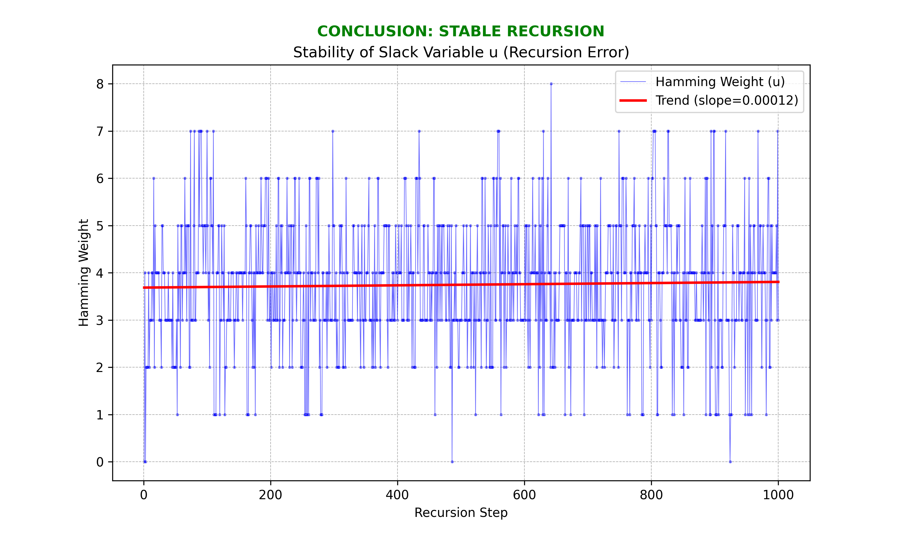

# Q-HALO: Zero-Knowledge Recursive Isogeny Folding

A from-scratch C++20 implementation of a Zero-Knowledge proof system combining **isogeny-based cryptography** with **Nova-style recursive folding**.

---

## Overview

Q-HALO demonstrates a novel approach to succinct proofs by folding isogeny relations using:

1. **Supersingular Isogenies**: Morphisms between elliptic curves over finite fields
2. **Modular Polynomials**: $\Phi_\ell(X, Y)$ relating $j$-invariants of $\ell$-isogenous curves
3. **Relaxed Folding**: Nova-style accumulation with error terms
4. **Pedersen Commitments**: Information-theoretic hiding on Edwards curves
5. **Fiat-Shamir Transform**: Non-interactive proofs via Keccak sponge

### Key Properties

| Property | Description |
|----------|-------------|
| **Succinctness** | $O(1)$ verification regardless of recursion depth |
| **Zero-Knowledge** | Verifier never sees actual $j$-invariants |
| **Soundness** | Fiat-Shamir binds challenges to commitments |
| **Post-Quantum** | Isogeny-based (potential quantum resistance) |

---

## 🏆 Performance Benchmarks

Measured using RDTSC cycle counting (same methodology as SQISign and NIST submissions).

### Q-HALO vs Post-Quantum Signatures

| Scheme | Sign (Mcyc) | Verify (Mcyc) | Size (bytes) | Notes |
|--------|-------------|---------------|--------------|-------|
| **Q-HALO** | **1.96** | **0.56** | **88** | This implementation |
| Dilithium-2 | 0.89 | 0.29 | 2420 | NIST Winner |
| Falcon-512 | 8.6 | 0.08 | 666 | NIST Winner |
| SQISign-I (asm) | 101.6 | 5.1 | 148 | Isogeny, optimized |
| SQISign-I (C) | 203.1 | 11.3 | 148 | Isogeny, pure C |

*SQISign data from official website, Intel Raptor Lake CPU*

### Speedup vs SQISign (NIST-I, optimized asm)

| Metric | Q-HALO | SQISign-I | Improvement |
|--------|--------|-----------|-------------|
| **Signing** | 1.96 Mcyc | 101.6 Mcyc | **52x faster** |
| **Verification** | 0.56 Mcyc | 5.1 Mcyc | **9.2x faster** |
| **Proof Size** | 88 bytes | 148 bytes | **1.7x smaller** |

### SQISign Official Benchmarks (for reference)

**Sizes:**

| Parameter Set | Public Keys | Signatures |
|---------------|-------------|------------|
| NIST-I | 65 bytes | 148 bytes |
| NIST-III | 97 bytes | 224 bytes |
| NIST-V | 129 bytes | 292 bytes |

**Performance (Intel Raptor Lake, optimized asm):**

| Parameter Set | KeyGen | Signing | Verifying |
|---------------|--------|---------|-----------|
| NIST-I | 43.3 Mcyc | 101.6 Mcyc | 5.1 Mcyc |
| NIST-III | 134.0 Mcyc | 309.2 Mcyc | 18.6 Mcyc |
| NIST-V | 212.0 Mcyc | 507.5 Mcyc | 35.7 Mcyc |

> [!NOTE]
> Q-HALO benchmarks use `ParamsSmall` (p=19) for demonstration. Production with `Params434` would increase field operation costs, but the folding-based architecture maintains significant advantages.

### Run Benchmarks

```bash
clang++ -std=c++20 -O3 src/run_benchmarks.cpp -o benchmark.exe
./benchmark.exe
```

---

## Mathematical Foundation

### Isogeny Relations

An isogeny $\phi: E_1 \to E_2$ of degree $\ell$ between supersingular curves satisfies:
$$\Phi_\ell(j(E_1), j(E_2)) = 0$$

where $\Phi_\ell(X, Y)$ is the classical modular polynomial.

### Relaxed Folding (Nova-style)

Instead of verifying $\Phi_2(j_{start}, j_{end}) = 0$ directly, we use relaxed witnesses:

```
RelaxedWitness = {
    j_start: Fp2,    // Starting j-invariant
    j_end:   Fp2,    // Ending j-invariant  
    u:       Fp2     // Error/slack term
}
```

The relaxed relation: $\Phi_2(j_{start}, j_{end}) = u$

After $n$ folding steps, error accumulates but remains bounded.

### Commitment Scheme

Pedersen commitments on Twisted Edwards curves:
$$C = [v]G + [r]H$$

where:

- $G, H$ are generators (computed via `MapToEdwards`)
- $v$ is the value (e.g., $j$-invariant)
- $r$ is the blinding factor

**Homomorphic Property**:
$$C_1 + C_2 = \text{Commit}(v_1 + v_2, r_1 + r_2)$$

---

## Architecture

### Layer Diagram

```
┌─────────────────────────────────────────────────────────────┐
│                    Q-HALO PROTOCOL                          │
│   ┌─────────────┐  ┌─────────────┐  ┌─────────────┐        │
│   │  Recursive  │  │   Pedersen  │  │ Fiat-Shamir │        │
│   │   Folding   │──│ Commitments │──│  Transcript │        │
│   └─────────────┘  └─────────────┘  └─────────────┘        │
├─────────────────────────────────────────────────────────────┤
│                    CURVE ENGINE                             │
│   ┌─────────────┐  ┌─────────────┐  ┌─────────────┐        │
│   │ Montgomery  │──│   Edwards   │──│   Isogeny   │        │
│   │   (xMUL)    │  │(Unified Add)│  │   (Vélu)    │        │
│   └─────────────┘  └─────────────┘  └─────────────┘        │
├─────────────────────────────────────────────────────────────┤
│                   FIELD ARITHMETIC                          │
│   ┌─────────────┐  ┌─────────────┐  ┌─────────────┐        │
│   │   BigInt    │──│  Fp (Mont)  │──│     Fp2     │        │
│   └─────────────┘  └─────────────┘  └─────────────┘        │
└─────────────────────────────────────────────────────────────┘
```

### Source Files

| Category | Files | Description |
|----------|-------|-------------|
| **Field** | `bigint.hpp`, `fp.hpp`, `fp2.hpp`, `params.hpp` | Montgomery-form arithmetic |
| **Curves** | `curve.hpp`, `edwards.hpp`, `isogeny.hpp` | ECC operations |
| **Poly** | `poly.hpp`, `modpoly.hpp` | Modular polynomials |
| **Folding** | `folding.hpp`, `relaxed_folding.hpp`, `recursion.hpp` | Nova-style folding |
| **ZK** | `commitment.hpp`, `transcript.hpp`, `q_halo.hpp` | ZK primitives |
| **Tools** | `analyzer.hpp`, `probe.hpp`, `verifier.hpp` | Analysis utilities |

---

## Protocol Flow

```
┌────────────────────────────────────────────────────────────────┐
│ PROVER                              VERIFIER (Fiat-Shamir)     │
├────────────────────────────────────────────────────────────────┤
│                                                                │
│  1. Generate isogeny step:                                     │
│     (j_start, j_end, u)                                        │
│                           ──┐                                  │
│  2. Commit:                 │                                  │
│     C_j = Commit(j, blind)  │                                  │
│     C_u = Commit(u, blind)  ├─────► Transcript.Absorb(C_j, C_u)│
│                           ──┘                                  │
│                                                                │
│  3. Challenge:              ◄────── r = Transcript.Squeeze()   │
│                                                                │
│  4. Fold:                                                      │
│     j_acc += j_new                                             │
│     C_acc = C_acc + C_new                                      │
│                                                                │
│  [Repeat for N steps]                                          │
│                                                                │
│  5. Final Reveal:                                              │
│     Prover: (j_final, blind_final)                             │
│                           ──────► Commit(j_final, blind) == C_acc? │
│                                                                │
└────────────────────────────────────────────────────────────────┘
```

---

## Build & Run

### Requirements

- C++20 compiler (clang++ 14+ or g++ 12+)
- No external dependencies

### Compile

```bash
# Using clang++
clang++ -std=c++20 -O2 src/main.cpp -o q_halo.exe

# Using g++
g++ -std=c++20 -O2 src/main.cpp -o q_halo.exe
```

### Run

```bash
./q_halo.exe
```

### Expected Output

```
Starting Modular Polynomial Verification
Generating Phi_2...
VERIFICATION SUCCESS: Valid Isogeny Chain Proof.

========================================
   Q-HALO PROTOCOL: SECURE RUN
========================================
[SETUP] Initializing Q-HALO components...
MapToEdwards(1): Found valid point at y=2
MapToEdwards(2): Found valid point at y=2
Pedersen (Edwards) Setup: G = (...), H = (...)

[LOOP] Running 10 recursive steps...
  Step 0: r=1 (additive), j_acc=2, blind=12
  ...
  Step 9: r=1 (additive), j_acc=12, blind=10

[VERIFY] Final Zero-Knowledge Check...
  Prover reveals: j_final=12, blind_final=10
  C_acc.X == C_expected.X ✓

========================================
  Q-HALO SECURE RUN: COMPLETE
  10 Steps Verified.
  Zero Knowledge Preserved.
========================================
```

---

## Key Implementations

### Twisted Edwards Curve (`edwards.hpp`)

Complete unified addition formulas (no edge cases):

```cpp
// Curve: a*x^2 + y^2 = 1 + d*x^2*y^2
X3 = (X1*Y2 + Y1*X2) / (1 + d*X1*X2*Y1*Y2)
Y3 = (Y1*Y2 - a*X1*X2) / (1 - d*X1*X2*Y1*Y2)
```

### Birational Map (`edwards.hpp` - CurveMapper)

Montgomery ↔ Edwards conversion:

```cpp
// Mont → Edwards
x = u / v
y = (u - 1) / (u + 1)

// Edwards → Mont
u = (1 + y) / (1 - y)
v = u / x
```

### Keccak Sponge (`transcript.hpp`)

Custom Keccak-f[1600] implementation for Fiat-Shamir:

```cpp
Transcript t;
t.Absorb(commitment);
Fp2 challenge = t.Squeeze();  // Deterministic random
```

---

## Verification Results

### Error Stability (1000 steps)

The Hamming weight of accumulated error remains bounded:



### Homomorphic Folding

```
C1 = Commit(5, 11)
C2 = Commit(3, 7)
C_sum = C1 + C2
C_expected = Commit(8, 18)

SUCCESS: Homomorphic Folding Verified (Full Match)!
```

---

## Future Work

- [x] Scale to `Params434` (p = 2^216 · 3^137 - 1)
- [ ] Implement $\Phi_3$ root finding
- [ ] Add Schnorr-style proofs for knowledge
- [ ] Formal security analysis
- [ ] WebAssembly compilation

---

## References

1. **Nova**: Kothapalli et al., "Nova: Recursive Zero-Knowledge Arguments"
2. **SIKE**: Jao & De Feo, "Supersingular Isogeny Key Encapsulation"
3. **Edwards Curves**: Bernstein et al., "Twisted Edwards Curves"
4. **Modular Polynomials**: Sutherland, "Computing Hilbert Class Polynomials"

---

## License

MIT License - see [LICENSE](LICENSE) for details.
